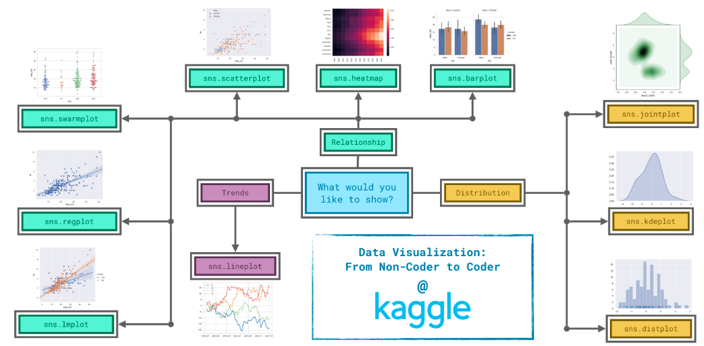
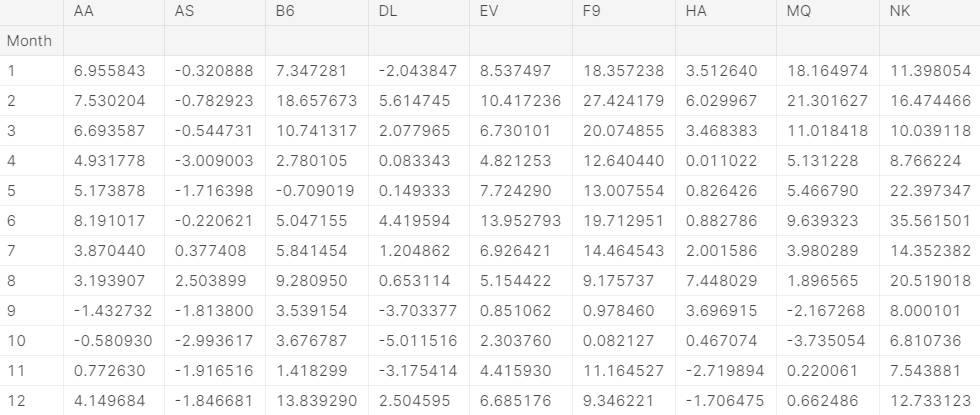
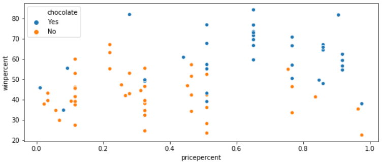
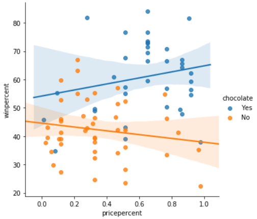

Seaborn: https://seaborn.pydata.org/api.html

# Line charts
- load data
```python
import pandas as pd
pd.plotting.register_matplotlib_converters()
import matplotlib.pyplot as plt
%matplotlib inline
import seaborn as sns

museum_data = pd.read_csv(museum_filepath, index_col='Date', parse_dates=True)
```


- Line chart showing the number of visitors to each museum over time
```python
plt.figure(figsize=(14,6)) 
sns.lineplot(data=museum_data)
plt.title('traffict at museums')
plt.xlabel('date')
```


# Bar charts and heatmaps

```python
# Set the width and height of the figure
plt.figure(figsize=(10,6))

# Bar chart showing average arrival delay for Spirit Airlines flights by month
sns.barplot(x=flight_data.index, y=flight_data['NK'])

# Add title
plt.title("Average Arrival Delay for Spirit Airlines Flights, by Month")

# Add label for vertical axis
plt.ylabel("Arrival delay (in minutes)")
```


```python
# Set the width and height of the figure
plt.figure(figsize=(14,7))

# Heatmap showing average arrival delay for each airline by month
sns.heatmap(data=flight_data, annot=True)

# Add title
plt.title("Average Arrival Delay for Each Airline, by Month")

# Add label for horizontal axis
plt.xlabel("Airline")
```


# Scatter plots
- scatter plot
```python
# Scatter plot showing the relationship between 'sugarpercent' and 'winpercent'
plt.figure(figsize=(10,4)) # Your code here
sns.scatterplot(x=candy_data.sugarpercent, y=candy_data.winpercent)
```
- scatter plot with a regression line
```python
# Scatter plot w/ regression line showing the relationship between 'sugarpercent' and 'winpercent'
plt.figure(figsize = (14,6)) # Your code here
sns.regplot(x=candy_data.sugarpercent, y=candy_data.winpercent)
```


- scatter plot different colors for different categories
```python
# Scatter plot showing the relationship between 'pricepercent', 'winpercent', and 'chocolate'
plt.figure(figsize=(10,4)) # Your code here
sns.scatterplot(x=candy_data.pricepercent, y=candy_data.winpercent, hue=candy_data.chocolate)
```


- regression lines by category
```python
# Color-coded scatter plot w/ regression lines
plt.figure(figsize=(10,4)) # Your code here
sns.lmplot(x='pricepercent', y='winpercent', hue='chocolate', data=candy_data)
```


# Distributions

- Histogram
```python
# Histograms for benign and maligant tumors
sns.distplot(cancer_b_data['Area (mean)'], kde=False) # Your code here (benign tumors)
sns.distplot(cancer_m_data['Area (mean)'], kde=False) # Your code here (malignant tumors)
```


- KDE plot
```python
# KDE plots for benign and malignant tumors
sns.kdeplot(cancer_b_data['Area (mean)'], shade=True) # Your code here (benign tumors)
sns.kdeplot(cancer_m_data['Area (mean)'], shade=True) # Your code here (malignant tumors)
```


- 2D KDE plot
```python
# 2D KDE plot
sns.jointplot(x=iris_data['Petal Length (cm)'], y=iris_data['Sepal Width (cm)'], kind="kde")
```
