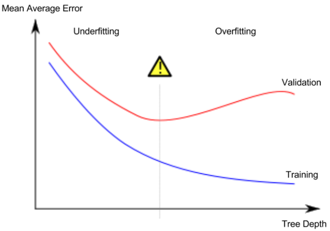
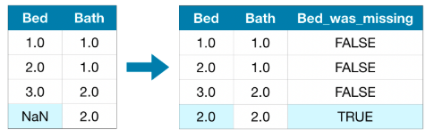
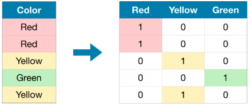
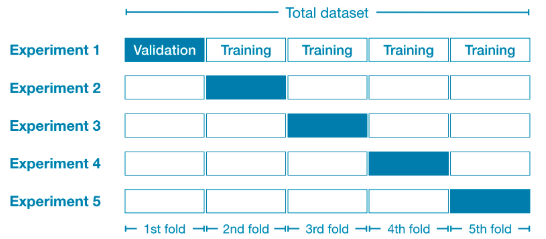
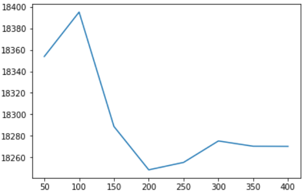
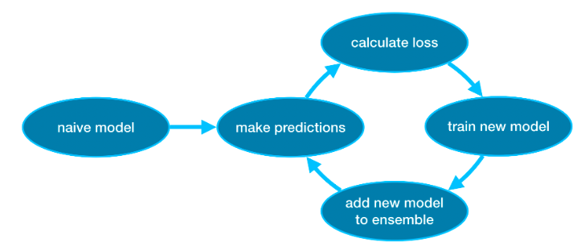

https://www.kaggle.com/learn/overview
# Intro to machine learning
## Key words
- decision tree regression; random forest
- model validation; train test split
- overfitting and underfitting
- optimum value of hyper parameter
## Note
- use DecisionTreeRegressor and radom forest as an example to predict house pricing in Iowa
- underfitting and overfitting (hyper parameter tuning)

## Sample code
### Basic
- load packages
```python
import pandas as pd
from sklearn.metrics import mean_absolute_error
from sklearn.model_selection import train_test_split
from sklearn.tree import DecisionTreeRegressor
```
- set up X and y
    - X should be a pd data frame. y should be a pd series
```python
# Path of the file to read
iowa_file_path = '../input/home-data-for-ml-course/train.csv'

home_data = pd.read_csv(iowa_file_path)
# Create target object and call it y
y = home_data.SalePrice
# Create X
features = ['LotArea', 'YearBuilt', '1stFlrSF', '2ndFlrSF', 'FullBath', 'BedroomAbvGr', 'TotRmsAbvGrd']
X = home_data[features]
```

- train test split
```python
train_X, val_X, train_y, val_y = train_test_split(X, y, random_state=1)
```

- specify model
```python
iowa_model = DecisionTreeRegressor(random_state=1)
```

- fit model
```python
iowa_model.fit(train_X, train_y)
```

- make validation predictions and calculate MAE
```python
val_predictions = iowa_model.predict(val_X)
val_mae = mean_absolute_error(val_predictions, val_y)
print("Validation MAE when not specifying max_leaf_nodes: {:,.0f}".format(val_mae))
```
## Hyper-parameter tuning
- use a utility function to help compare MAE scores from different values for max_leaf_nodes
```python
def get_mae(max_leaf_nodes, train_X, val_X, train_y, val_y):
    model = DecisionTreeRegressor(max_leaf_nodes=max_leaf_nodes, random_state=0)
    model.fit(train_X, train_y)
    preds_val = model.predict(val_X)
    mae = mean_absolute_error(val_y, preds_val)
    return(mae)
```
- compare MAE with differing values of max_leaf_nodes
```python
for max_leaf_nodes in [5, 50, 500, 5000]:
    my_mae = get_mae(max_leaf_nodes, train_X, val_X, train_y, val_y)
    print("Max leaf nodes: %d  \t\t Mean Absolute Error:  %d" %(max_leaf_nodes, my_mae))
```
- find the ideal tree size from candidate_max_leaf_nodes, a smart way to use dictionary
```python
candidate_max_leaf_nodes = [5, 25, 50, 100, 250, 500]
# Write loop to find the ideal tree size from candidate_max_leaf_nodes
scores = {leaf_size: get_mae(leaf_size, train_X, val_X, train_y, val_y) for leaf_size in candidate_max_leaf_nodes}
# get the key for min value
best_tree_size = min(scores, key=scores.get)
```

## Fit model using all data
```python
# set up model using tuned hyper-parameter
final_model = DecisionTreeRegressor(max_leaf_nodes=best_tree_size, random_state=1)

# fit the final model
final_model.fit(X, y)
```

## Random forest
```python
from sklearn.ensemble import RandomForestRegressor

# Define the model. Set random_state to 1
rf_model = RandomForestRegressor(random_state=1)

# fit your model
rf_model.fit(train_X, train_y)

# Calculate the mean absolute error of your Random Forest model on the validation data
rf_val_mae = mean_absolute_error(val_y, rf_model.predict(val_X))

print("Validation MAE for Random Forest Model: {}".format(rf_val_mae))
```

# Intermediate machine learning
## Key words
- missing values
- categorical variables
- pipelines
- cross validation
- XGBoost
- leakage
## Missing values
### drop
- drop columns or rows (or sample) with missing values
    - works if like 80% of values are missing for a column
    - lose information if most value of the column is not missing
- To detect NaN values numpy uses np.isnan(). 
- To detect NaN values pandas uses either .isna() or .isnull(). They're exactly the same

```python
# Get names of columns with missing values
cols_with_missing = [col for col in X_train.columns
                     if X_train[col].isnull().any()]

# Drop columns in training and validation data
reduced_X_train = X_train.drop(cols_with_missing, axis=1)
```
### imputation
- simple imputation: fill in mean, median, most frequent values
- more complex ways: 
    - regression imputer
        - should be the IteractiveImputer in sklearn
        - A strategy for imputing missing values by modeling each feature with missing values as a function of other features 
    - KNN imputer
        - Each sample’s missing values are imputed using the mean value from n_neighbors nearest neighbors found in the training set. Two samples are close if the features that neither is missing are close.

```python
from sklearn.impute import SimpleImputer

# Imputation
my_imputer = SimpleImputer()
imputed_X_train = pd.DataFrame(my_imputer.fit_transform(X_train))

# Imputation removed column names; put them back
imputed_X_train.columns = X_train.columns
```

### An extension to imputation
- intuition: imputed values may be systematically above or below their actual values (which weren't collected in the dataset). Or rows with missing values may be unique in some other way. In that case, your model would make better predictions by considering which values were originally missing.
- method: add a new column to indicate which value is missing


```python
# Make copy to avoid changing original data (when imputing)
X_train_plus = X_train.copy()

# Make new columns indicating what will be imputed
for col in cols_with_missing:
    X_train_plus[col + '_was_missing'] = X_train_plus[col].isnull()

# Imputation
my_imputer = SimpleImputer()
imputed_X_train_plus = pd.DataFrame(my_imputer.fit_transform(X_train_plus))

# Imputation removed column names; put them back
imputed_X_train_plus.columns = X_train_plus.columns
```
### sample codes together
- useful codes
```python
# 1. df drop columns or rows
df.dropna(axis=1, subset=[col1, col2], inplace=True)
# 2. df select columns with specific data types
df.select_dtypes(exclude=['object'])
```
- prepare the data
```python
import pandas as pd
from sklearn.model_selection import train_test_split

# Remove rows with missing target, separate target from predictors
X_full.dropna(axis=0, subset=['SalePrice'], inplace=True)
y = X_full.SalePrice
X_full.drop(['SalePrice'], axis=1, inplace=True)

# To keep things simple, we'll use only numerical predictors
X = X_full.select_dtypes(exclude=['object'])
X_test = X_test_full.select_dtypes(exclude=['object'])

# Break off validation set from training data
X_train, X_valid, y_train, y_valid = train_test_split(X, y, train_size=0.8, test_size=0.2,
                                                      random_state=0)
```
- preliminary investigation
```python
# Number of missing values in each column of training data
missing_val_count_by_column = X_train.isnull().sum() # pd series
print(missing_val_count_by_column[missing_val_count_by_column > 0])
```
- set up evaluation metrix
```python
from sklearn.ensemble import RandomForestRegressor
from sklearn.metrics import mean_absolute_error

# Function for comparing different approaches
def score_dataset(X_train, X_valid, y_train, y_valid):
    model = RandomForestRegressor(n_estimators=100, random_state=0)
    model.fit(X_train, y_train)
    preds = model.predict(X_valid)
    return mean_absolute_error(y_valid, preds)
```

- method 1: drop columns with missing values
```python
missing_columns = [col for col in X_train.columns if X_full[col].isnull().any()] 
reduced_X_train = X_train.drop(missing_columns, axis=1)
reduced_X_valid = X_valid.drop(missing_columns, axis=1)

print("MAE (Drop columns with missing values):")
print(score_dataset(reduced_X_train, reduced_X_valid, y_train, y_valid))
```

- method 2: imputation
    - the outcome of fit is an SimpleImputer object
    - the outcome of fit_transform is np array
    - note for X_valid, just transform
```python
from sklearn.impute import SimpleImputer

# Fill in the lines below: imputation
My_imputer = SimpleImputer(strategy='median') 
imputed_X_train = pd.DataFrame(My_imputer.fit_transform(X_train))
imputed_X_valid = pd.DataFrame(My_imputer.transform(X_valid))

# Fill in the lines below: imputation removed column names; put them back
imputed_X_train.columns = X_train.columns
imputed_X_valid.columns = X_valid.columns

print("MAE (Imputation):")
print(score_dataset(imputed_X_train, imputed_X_valid, y_train, y_valid))
```
## Categorical variables
### label encoding
- Encode target labels with value between 0 and n_classes-1
- make more sense for ordinal variables

### One-hot encoding
- creates new columns indicating the presence (or absence) of each possible value in the original data

- works well for nominal variables
- not perform well if the categorical variable takes on a large number of values (i.e., not well if number of categories > 15)

### sample codes
#### method 1: drop categorical variabels
```python
# drop columns in training and validation data
drop_X_train = X_train.select_dtypes(exclude='object')
drop_X_valid = X_valid.select_dtypes(exclude='object')
```
#### method 2: label encoding
    - fit to training data and use it to transform both the training and validation data
    - if existing some categories in validation data but not in training data, there'll be an error
    - the simplest way to deal with this is to drop the problematic categorical columns
```python
# All categorical columns
object_cols = [col for col in X_train.columns if X_train[col].dtype == "object"]

# Columns that can be safely label encoded
good_label_cols = [col for col in object_cols if 
                   set(X_train[col]) == set(X_valid[col])]
        
# Problematic columns that will be dropped from the dataset
bad_label_cols = list(set(object_cols)-set(good_label_cols))
```
```python
from sklearn.preprocessing import LabelEncoder

# Drop categorical columns that will not be encoded
label_X_train = X_train.drop(bad_label_cols, axis=1)
label_X_valid = X_valid.drop(bad_label_cols, axis=1)

# Apply label encoder 
L_encoder = LabelEncoder() 
for col in good_label_cols:
    label_X_train[col] = L_encoder.fit_transform(label_X_train[col])
    label_X_valid[col] = L_encoder.transform(label_X_valid[col])
```

#### method 3: One-hot encoding
- investigate cardinality first, drop or encoding variables having high cardinality with label encoder instead.
```python
# Get number of unique entries in each column with categorical data
object_nunique = list(map(lambda col: X_train[col].nunique(), object_cols))
d = dict(zip(object_cols, object_nunique))

# Print number of unique entries by column, in ascending order
sorted(d.items(), key=lambda x: x[1])
```
```python
# Columns that will be one-hot encoded
low_cardinality_cols = [col for col in object_cols if X_train[col].nunique() < 10]

# Columns that will be dropped from the dataset
high_cardinality_cols = list(set(object_cols)-set(low_cardinality_cols))
```
- handle_unknown='ignore', so it doesn't matter if existing problematic categorial columns
```python
from sklearn.preprocessing import OneHotEncoder

# Use as many lines of code as you need!
OH_encoder = OneHotEncoder(handle_unknown='ignore', sparse=False) 
OH_cols_train = pd.DataFrame(OH_encoder.fit_transform(X_train[low_cardinality_cols])) # Your code here
OH_cols_valid = pd.DataFrame(OH_encoder.transform(X_valid[low_cardinality_cols])) # Your code here

# One-hot encoding removed index; put it back
OH_cols_train.index = X_train.index
OH_cols_valid.index = X_valid.index

# Remove categorical columns (will replace with one-hot encoding)
num_X_train = X_train.drop(object_cols, axis=1)
num_X_valid = X_valid.drop(object_cols, axis=1)

# Add one-hot encoded columns to numerical features
OH_X_train = pd.concat([num_X_train, OH_cols_train], axis=1)
OH_X_valid = pd.concat([num_X_valid, OH_cols_valid], axis=1)
```

# Pipelines
- valuable for cleaning up machine learning codes and avoiding errors
- good for workflows with sophisticated data preprocessing
## sample code
- sklearn.compose.ColumnTransformer(transformers=List of (name, transformer, column(s)))
    - This estimator allows different columns or column subsets of the input to be transformed separately and the features generated by each transformer will be concatenated to form a single feature space.
- sklearn.pipeline.Pipeline(steps=List of (name, transform))
- don't need to fit validation data, it'll be automatically fitted if using pipeline

```
model
preprocessor
    numeric_transformer
        imputer
    categorical_transformer
        imputer
        onehot
```
- select columns
```python
# "Cardinality" means the number of unique values in a column
# Select categorical columns with relatively low cardinality (convenient but arbitrary)
categorical_cols = [cname for cname in X_train_full.columns if
                    X_train_full[cname].nunique() < 10 and 
                    X_train_full[cname].dtype == "object"]

# Select numerical columns
numerical_cols = [cname for cname in X_train_full.columns if 
                X_train_full[cname].dtype in ['int64', 'float64']]

# Keep selected columns only
my_cols = categorical_cols + numerical_cols
X_train = X_train_full[my_cols].copy()
X_valid = X_valid_full[my_cols].copy()
X_test = X_test_full[my_cols].copy()
```
- preprocess numeric and categorical data
```python
from sklearn.compose import ColumnTransformer
from sklearn.pipeline import Pipeline
from sklearn.impute import SimpleImputer
from sklearn.preprocessing import OneHotEncoder
from sklearn.ensemble import RandomForestRegressor
from sklearn.metrics import mean_absolute_error

# Preprocessing for numerical data
numerical_transformer = SimpleImputer(strategy='constant')

# Preprocessing for categorical data
categorical_transformer = Pipeline(steps=[
    ('imputer', SimpleImputer(strategy='most_frequent')),
    ('onehot', OneHotEncoder(handle_unknown='ignore'))
])

# Bundle preprocessing for numerical and categorical data
preprocessor = ColumnTransformer(
    transformers=[
        ('num', numerical_transformer, numerical_cols),
        ('cat', categorical_transformer, categorical_cols)
    ])

```
- define model
```python
# Define model
model = RandomForestRegressor(n_estimators=100, random_state=0)

# Bundle preprocessing and modeling code in a pipeline
clf = Pipeline(steps=[('preprocessor', preprocessor),
                      ('model', model)
                     ])

# Preprocessing of training data, fit model 
clf.fit(X_train, y_train)

# Preprocessing of validation data, get predictions
preds = clf.predict(X_valid)

print('MAE:', mean_absolute_error(y_valid, preds))
```
# Cross-validation
## notes
- use different subsets of the data as validate the model

- give a more accurate measure of model quality, but take more time to run
    - small dataset, use cross-validation
    - large dataset, a single validation is sufficient

## sample code
- much easier to use pipeline
- scoring parameter: https://scikit-learn.org/stable/modules/model_evaluation.html
- Scikit-learn has a convention where all metrics are defined so a high number is better. So MAE score is negative here.

- in this example, just use numerical columns to predict price
    - simple imputer
    - random forest regressor
    - use cross validation to tune the n_estimators in random forest
        - too low is underfitting
        - too high is overfitting
```python
import pandas as pd

# Remove rows with missing target, separate target from predictors
train_data.dropna(axis=0, subset=['SalePrice'], inplace=True)
y = train_data.SalePrice              
train_data.drop(['SalePrice'], axis=1, inplace=True)

# Select numeric columns only
numeric_cols = [cname for cname in train_data.columns if train_data[cname].dtype in ['int64', 'float64']]
X = train_data[numeric_cols].copy()
```

- function `get_score()` that reports the average (over three cross-validation folds) MAE of a machine learning pipeline
```python
from sklearn.ensemble import RandomForestRegressor
from sklearn.pipeline import Pipeline
from sklearn.impute import SimpleImputer
from sklearn.model_selection import cross_val_score

def get_score(n_estimators):
    """Return the average MAE over 3 CV folds of random forest model.
    
    Keyword argument:
    n_estimators -- the number of trees in the forest
    """
    my_pipelines = Pipeline(steps=[('preprocessor', SimpleImputer()),
                                   ('model', RandomForestRegressor(n_estimators=n_estimators, random_state=0))])
    scores = -1 * cross_val_score(my_pipelines, X, y, cv=3, scoring='neg_mean_absolute_error')
    return scores.mean()
```
- test differet hyper-parameter values, and store them in a dictionary
```python
results = {} 
for i in range(1, 9):
    results[50 * i] = get_score(n_estimators=50 * i)

```
- find the best hyper-parameter value
```python
import matplotlib.pyplot as plt
%matplotlib inline

plt.plot(results.keys(), results.values())
plt.show()
```


# Xgboost
## Notes
- good for standard tabular data
- extreme gradient boosting: ensemble method
    - ensemble methods combine the predictions of several models (e.g., several trees, in the case of random forests).
- Gradient boosting is a method that goes through cycles to iteratively add models into an ensemble.

- key parameters tuning
    - n_estimators
        -  how many times to go through the modeling cycle. number of models
        - too low: underfitting
        - too high: overfitting
    - early_stopping_rounds
        - causes the model to stop iterating when the validation score stops improving, even if we aren't at the hard stop for n_estimators
        - since a single round could be by chance, usually set as 5, stop after 5 straight rounds of deteriorating validation scores
    - eval_set
        - When using early_stopping_rounds, you also need to set aside some data for calculating the validation scores - this is done by setting the eval_set parameter
    - learning_rate
        - Instead of getting predictions by simply adding up the predictions from each component model, we can multiply the predictions from each model by a small number (known as the learning rate) before adding them in.
        - This means each tree we add to the ensemble helps us less. So, we can set a higher value for n_estimators without overfitting. 
    - n_jobs
        - use parallelism to build your models faster
            - It's common to set the parameter n_jobs equal to the number of cores on your machine. On smaller datasets, this won't help.
- In general, a small learning rate and large number of estimators will yield more accurate XGBoost models, though it will also take the model longer to train

## Sample codes
- scikit-learn has a gradient module, but XGBoost has some technical advantages  https://xgboost.readthedocs.io/en/latest/python/python_api.html#xgboost.XGBRegressor
- use numberic columns, and categorical columns with low cardinality
- drop missing values
- one-hot encoding using Pandas
```python 
import pandas as pd
from sklearn.model_selection import train_test_split

# Remove rows with missing target, separate target from predictors
X.dropna(axis=0, subset=['SalePrice'], inplace=True)
y = X.SalePrice              
X.drop(['SalePrice'], axis=1, inplace=True)

# Break off validation set from training data
X_train_full, X_valid_full, y_train, y_valid = train_test_split(X, y, train_size=0.8, test_size=0.2,
                                                                random_state=0)

# "Cardinality" means the number of unique values in a column
# Select categorical columns with relatively low cardinality (convenient but arbitrary)
low_cardinality_cols = [cname for cname in X_train_full.columns if X_train_full[cname].nunique() < 10 and 
                        X_train_full[cname].dtype == "object"]

# Select numeric columns
numeric_cols = [cname for cname in X_train_full.columns if X_train_full[cname].dtype in ['int64', 'float64']]

# Keep selected columns only
my_cols = low_cardinality_cols + numeric_cols
X_train = X_train_full[my_cols].copy()
X_valid = X_valid_full[my_cols].copy()
X_test = X_test_full[my_cols].copy()

# One-hot encode the data (to shorten the code, we use pandas)
X_train = pd.get_dummies(X_train)
X_valid = pd.get_dummies(X_valid)
X_test = pd.get_dummies(X_test)
X_train, X_valid = X_train.align(X_valid, join='left', axis=1)
X_train, X_test = X_train.align(X_test, join='left', axis=1)
```
- Pandas.align https://stackoverflow.com/questions/51645195/pandas-align-function-illustrative-example

- build the model
    - verbose=False, otherwise will print the iteration details
```python
from xgboost import XGBRegressor
from sklearn.metrics import mean_absolute_error

# Define the model
my_model_2 = XGBRegressor(n_estimators=500, learning_rate=0.05, n_jobs=4) 

# Fit the model
my_model_2.fit(X_train, y_train, early_stopping_rounds=5, eval_set=[(X_valid, y_valid)], verbose=False) 

# Get predictions
predictions_2 = my_model_2.predict(X_valid) 

# Calculate MAE
mae_2 = mean_absolute_error(predictions_2, y_valid
```